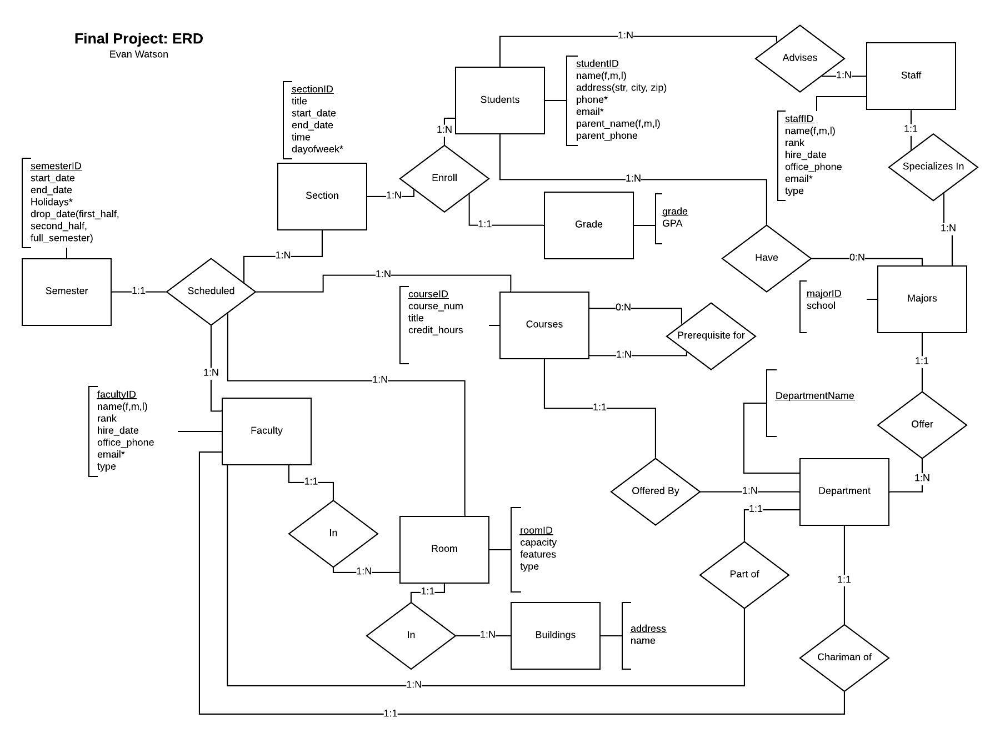

# Information Representation Final Project
## Last Updated: 6/23/2020
For this classes final project we were tasked with creating an ERD and developing the database using MySQL. We were eventually assigned a set of information to retrieve across multiple tables within the database we created. Please not this project was to show our skills in developing and retrieving information from a MySQL database. No time was spent for the front end.
### Link to form:  http://cgi.soic.indiana.edu/~evwatson/I308FinalProject.php 
 
QUERIES:

1b) Produce a class roster for a *specified section* sorted by student’s last name, first name. At the end, include the average grade (GPA for the class.) (10 points): 

SELECT DISTINCT CONCAT(Student.last_name, '  ',Student.first_name) AS name, ROUND(AVG(Grade.GPA),2) AS GPA
FROM Section, Student, Section_Enroll, Grade
WHERE Section.sectionID = Section_Enroll.sectionID AND Student.studentID = Section_Enroll.studentID AND Section.sectionID = 1 AND Section_Enroll.grade = Grade.grade
GROUP BY name, Section_Enroll.grade WITH ROLLUP; 

3b) Produce a list of faculty who have never taught a *specified course* [Dropdown](10 points):

SELECT CONCAT(Faculty.name_first, ' ', Faculty.name_middle, ' ', Faculty.name_last) AS Name
FROM Faculty
WHERE NOT EXISTS (
SELECT *
FROM Scheduled
WHERE Faculty.facultyID = Scheduled.facultyID AND
	Scheduled.courseID = 'BUS-E');

5b) Produce a chronological list of all courses taken by a *specified student*. Show grades earned. Include overall hours taken and GPA at the end. (10 points): 

SELECT DISTINCT c.courseID, c.course_num, g.grade, c.credit_hours, g.GPA AS GPA
FROM Course as c, Grade as g, Student as Stu, Section as s, Section_Enroll as se, Scheduled as sc
WHERE Stu.studentID = 1 AND se.sectionID = s.sectionID AND se.grade = g.grade AND c.courseID = sc.courseID AND Stu.studentID = se.studentID AND sc.sectionID = s.sectionID
UNION
SELECT 'OVERALL GPA:','','','', ROUND(SUM(Grade.GPA* Course.credit_hours)/SUM(IF(Section_Enroll.grade = 'NA', NULL, Course.credit_hours)),2) AS GPA
FROM Grade, Student, Course, Section, Section_Enroll, Scheduled
WHERE Section_Enroll.sectionID = Section.sectionID AND Section_Enroll.grade = Grade.grade AND Course.courseID = Scheduled.courseID AND Student.studentID = Section_Enroll.studentID AND Scheduled.sectionID = Section.sectionID AND Student.studentID = 1;

6c) Produce a list of students and faculty who were in a *particular building* at a *particular time*. Also include in the list faculty and advisors who have offices in that building. (15 points):

SELECT DISTINCT CONCAT(Faculty.name_first,' ', Faculty.name_last) AS faculty_name, 
	CONCAT(Student.first_name, ' ', Student.last_name) AS student_name, 
	'' AS staff_name

FROM Student, Faculty, Building, Section, Scheduled, Staff, Room, Section_Enroll
WHERE Building.address = Room.address AND Scheduled.sectionID = Section.sectionID 
	AND Scheduled.roomID = Room.roomID AND Scheduled.facultyID = Faculty.facultyID AND
	Section_Enroll.studentID = Student.studentID AND Section_Enroll.sectionID = Section.sectionID AND
Section.time = '02:15:00' AND 
	('2016-10-8' BETWEEN Section.start_date AND Section.end_date) AND Building.address = '20925 Bashford Trail'
UNION
SELECT  DISTINCT CONCAT(Faculty.name_first,' ', Faculty.name_last) AS faculty_name, 
'' AS student_name,
CONCAT(Staff.first_name, ' ', Staff.last_name) AS staff_name
FROM Section, Faculty, Building, Room, Staff
WHERE Faculty.roomID = Room.roomID AND Room.address = Building.address AND Staff.roomID = Room.roomID AND Building.address = '20925 Bashford Trail';

7a) Produce an alphabetical list of students with their majors who are advised by a *specified advisor*. (5 points): 

SELECT CONCAT(Student.first_name, ' ', Student.middle_name, ' ',Student.last_name) AS name, Major.majorID
FROM Student, Major, Staff, Student_Major, Staff_Students
WHERE Student_Major.studentID = Student.studentID AND Student_Major.majorID = Major.majorID AND Staff_Students.staffID = Staff.staffID AND Staff_Students.studentID = Student.studentID AND Staff.staffID = 1
GROUP BY Student.studentID
ORDER BY name;

ADDITIONAL QUERIES:

1. for a specific class, return student emails & phone numbers for contact purposes

SELECT CONCAT(Student.last_name, '  ', Student.first_name) AS Name, Student_Email.email, Student_Phone.phone
FROM Student_Email, Student_Phone, Student, Course, Scheduled
WHERE Course.courseID = 'BUS-E' AND Student.studentID = Student_Email.studentID AND Student.studentID = Student_Phone.studentID
GROUP BY Name;

2. produces a list of courses that have a 'Lab' section and it's time as well as the days of the week that it meets

SELECT Course.courseID,  Section.time, Section_Day.day
FROM Section, Course, Scheduled, Section_Day
WHERE Section.sectionID = Scheduled.sectionID AND Course.courseID = Scheduled.courseID AND Section.title = 'Lab' AND Section_Day.sectionID = Section.sectionID;

3. Check to find contact (Name, phone, email(s)) information for Chairperson each department has

SELECT CONCAT(Faculty.name_first, ' ', Faculty.name_middle, ' ', Faculty.name_last) AS name, Faculty.office_phone, Faculty_Email.email AS email
FROM Faculty, Faculty_Email
WHERE Faculty.rank = 'chairperson' AND Faculty.facultyID = Faculty_Email.facultyID;

