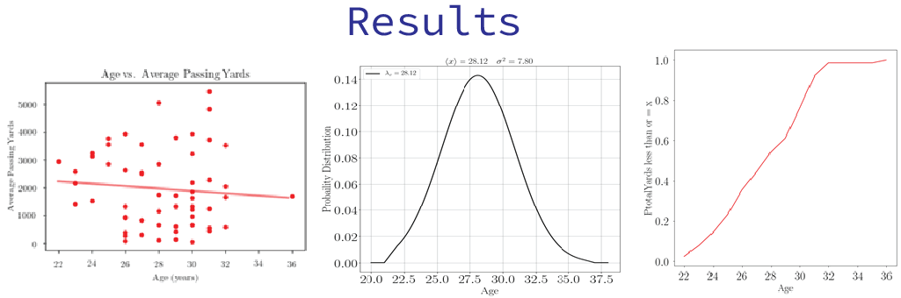

# Performance Analytics
##This repository holds the final submission for a performance analytics class I took at IU. It includes scatter plots, a normal distribution, and a Cumulative Probability Line Graph. The images below are the results of our findings.

##Click on the jupyter notebook to see how we scraped this information and all the data points we used to aggreagate these graphs. As well as our teams conclsion.
## Team Information

| Item        | Value           |
| ------------- |:-------------:|
| Team Name | Keepin' it Fresh |
| Platform | Android |
| Goal | Find if there is a correlation between certain features QB have, such as height, weight and age |

### Watson, Evan 