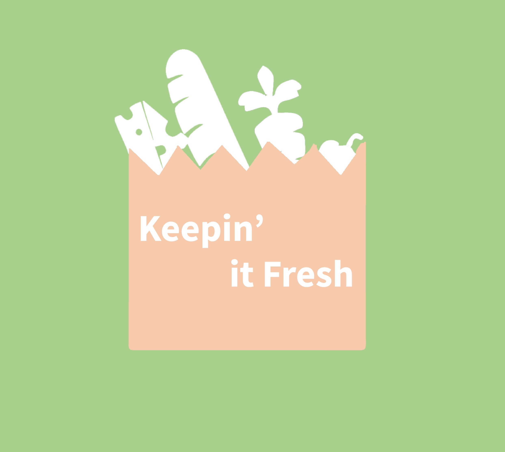
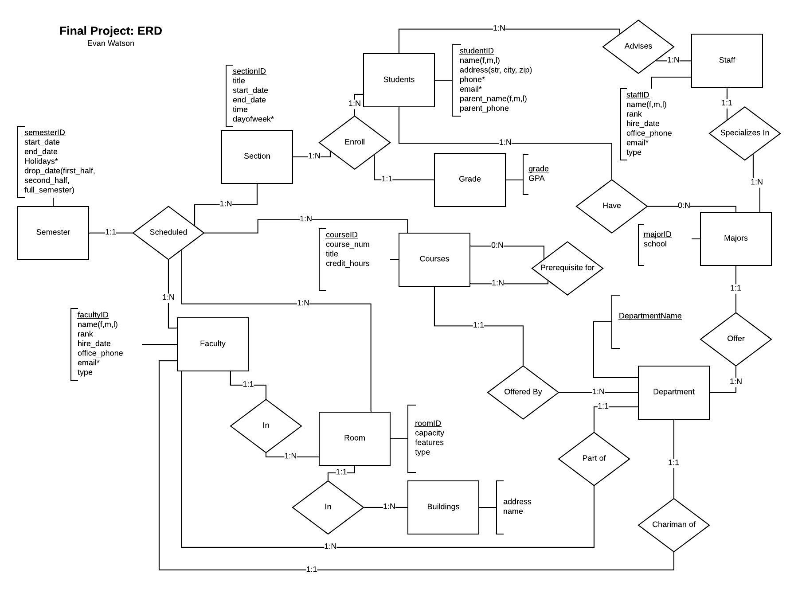
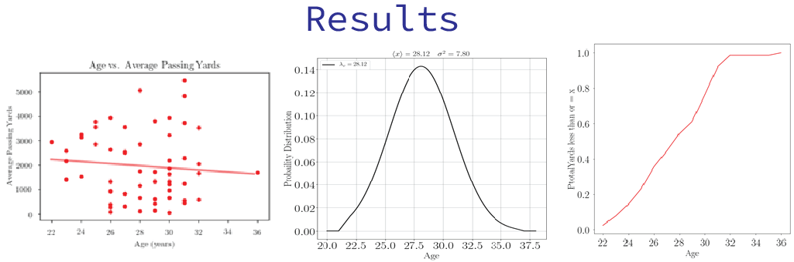

# Evan Watson's Portfolio
## Last Updated: 7/11/2020
The goal of this repository is to give access to potential employers Evan Watson's portfolio. Which includes both individual and group projects that he has accomplished.

 # Projects 

## <a href="https://github.com/evanwatson98/portfolio/tree/master/Capstone"> Keepin' it Fresh </a>

## <a href="https://github.com/evanwatson98/portfolio/tree/master/Database/Information%20Representation%20Final%20Project"> IU Database Final Project </a>

 

## <a href="https://github.com/evanwatson98/portfolio/tree/master/Performance%20Analytics"> Performance Analytics </a>

## <a href="https://github.com/evanwatson98/portfolio/tree/master/Performance%20Analytics"> Movie Theater GUI </a>
